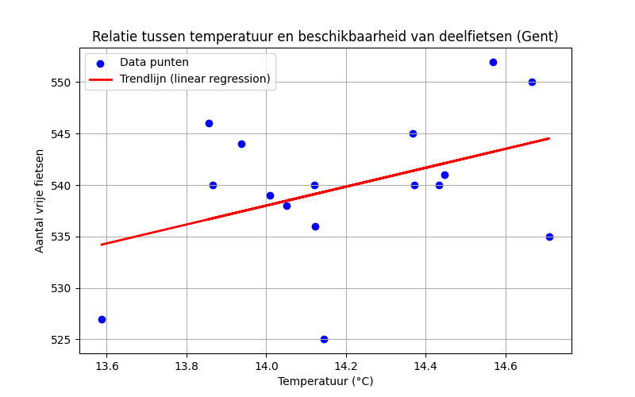
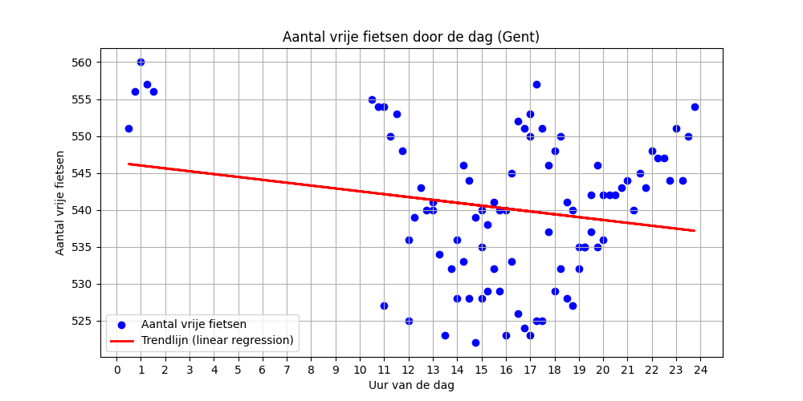

# Data Workflow Rapport

**Gegenereerd op:** 2025-11-15 20:30:15.084143

## Grafiek: Vrije fietsen vs Temperatuur

## Basisstatistieken
- Gemiddelde temperatuur: 14.44 °C
- Gemiddeld aantal vrije fietsen: 540
- Gemiddeld aantal fietsen overdag (07-19u): 538
- Gemiddeld aantal fietsen ’s nachts (19-07u): 544
- Correlatie: 0.20

## Vrije fietsen per weekdag

| Weekdag | Min | Max | Gemiddelde |
|---------|-----|-----|------------|
| Maandag | 0 | 0 | 0 |
| Dinsdag | 0 | 0 | 0 |
| Woensdag | 0 | 0 | 0 |
| Donderdag | 525 | 550 | 535 |
| Vrijdag | 535 | 557 | 545 |
| Zaterdag | 522 | 560 | 537 |
| Zondag | 0 | 0 | 0 |

---
## Grafiek: Vrije fietsen per uur

