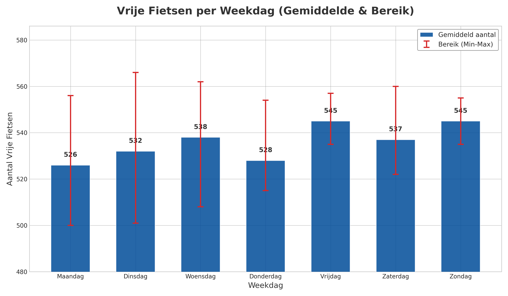

# DATA WORKFLOW RAPPORT
### Temperatuur vs Aantal Vrije Fietsen in Gent

**Opgesteld door:** Lars Geirnaert (Klas: 2E2)  
**Gegenereerd op:** 24-11-2025 11:00

---

## 📊 Statistische Samenvatting

| Statistiek | Waarde |
| :--- | ---: |
| Gemiddelde temperatuur | 7.62 °C |
| Gemiddeld aantal vrije fietsen | 540 |
| Gemiddeld aantal fietsen overdag (07-19u) | 534 |
| Gemiddeld aantal fietsen 's nachts (19-07u) | 549 |
| Correlatie temperatuur ↔ vrije fietsen | -0.13 |
| Correlatie uur ↔ vrije fietsen | 0.26 |

---

## 📈 Grafiek 1: Temperatuur vs Vrije Fietsen

---

## 📊 Grafiek 2: Aantal Fietsen per Uur

---

## 📅 Analyse per Weekdag

| Weekdag | Min | Max | Gem. Fietsen | Gem. Temp (°C) |
| :--- | --: | --: | --: | --: |
| Maandag | 500 | 556 | 524 | 5.48 |
| Dinsdag | 501 | 566 | 532 | 5.41 |
| Woensdag | 508 | 562 | 538 | 5.94 |
| Donderdag | 511 | 574 | 541 | 3.92 |
| Vrijdag | 535 | 580 | 548 | 11.14 |
| Zaterdag | 522 | 562 | 542 | 9.83 |
| Zondag | 535 | 559 | 546 | 7.80 |
