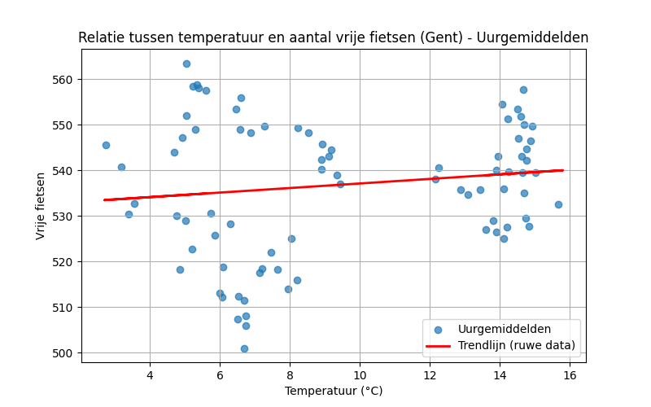
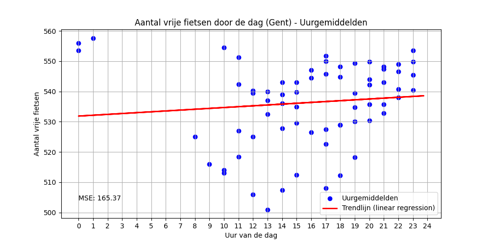

# Data Workflow Rapport

**Gegenereerd op:** 2025-11-19 23:15:39.158563

## Grafiek: Vrije fietsen vs Temperatuur

## Basisstatistieken
- Gemiddelde temperatuur: 9.26 °C
- Gemiddeld aantal vrije fietsen: 537
- Gemiddeld aantal fietsen overdag (07-19u): 532
- Gemiddeld aantal fietsen ’s nachts (19-07u): 545
- Correlatie: 0.09

## Vrije fietsen per weekdag

| Weekdag | Min | Max | Gemiddelde |
|---------|-----|-----|------------|
| Maandag | 500 | 556 | 526 |
| Dinsdag | 501 | 566 | 532 |
| Woensdag | 508 | 562 | 537 |
| Donderdag | 525 | 550 | 535 |
| Vrijdag | 535 | 557 | 545 |
| Zaterdag | 522 | 560 | 537 |
| Zondag | 535 | 555 | 545 |

---
## Grafiek: Vrije fietsen per uur

